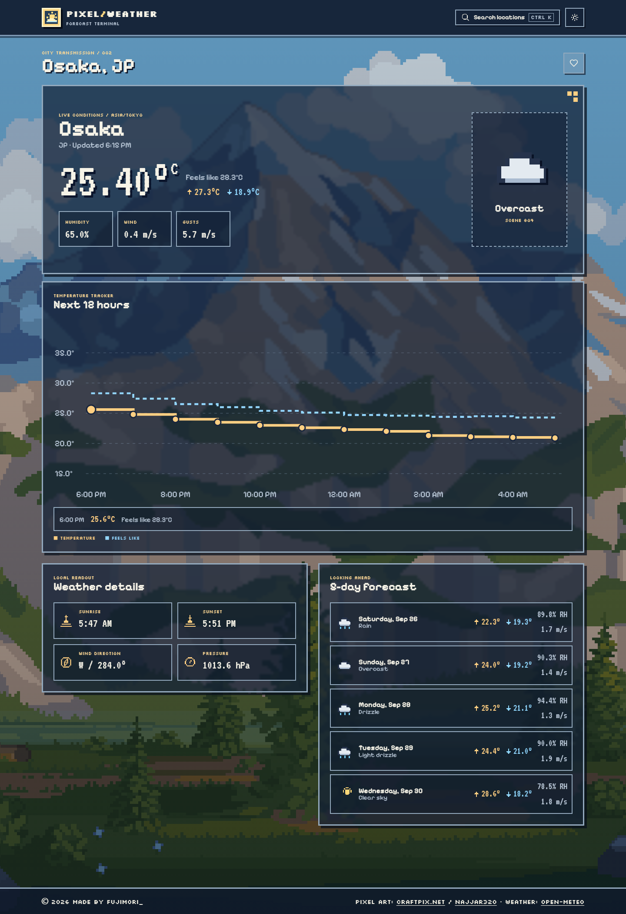

<div align="center">
  
  <h1>PixelWeather</h1>
  <p>A weather dashboard with pixel art skies, chunky type, and just enough retro jitter.</p>
  <p>
    <a href="#run-locally">Run locally</a> ·
    <a href="#what-it-shows">What it shows</a> ·
    <a href="#art-and-credits">Art and credits</a>
  </p>
</div>



<sub>Osaka preview captured with live weather data. Conditions will change.</sub>

## Run locally

```bash
npm ci
npm run dev
```

Open the address printed by Vite. Allow location access for your local forecast, or search for a city instead. The free Open-Meteo API needs no key for non-commercial use.

## What it shows

| View | Details |
| --- | --- |
| Current weather | Temperature, feels like, daily high and low, humidity, wind, gusts, pressure, sunrise, and sunset |
| Forecast | A stepped 12-hour temperature chart and five upcoming local calendar days |
| Places | City search, recent searches, and up to ten favourites saved in the browser |
| Scenes | Local pixel art for clear, cloudy, rainy, snowy, misty, stormy, and nighttime weather |

Press **Ctrl+K** or **⌘+K** to search. The theme button switches between dark and light panels. Rain and snow move in discrete steps, and reduced-motion settings stop those effects.

## Weather data

[Open-Meteo](https://open-meteo.com/) supplies the forecast and place search. PixelWeather adapts its weather codes for the scene and icon shown on each card. Open-Meteo's [free API terms](https://open-meteo.com/en/terms) allow non-commercial use and require attribution under CC BY 4.0. Commercial deployments need an appropriate [API plan](https://open-meteo.com/en/pricing).

## Art and credits

The scenes ship with the app. No image hotlinks are needed for the weather background.

| Scene | Local file | Artist and source | License |
| --- | --- | --- | --- |
| Clear | `sunny-landscape.png` | [CraftPix.net, Simple Natural Landscape](https://opengameart.org/content/simple-natural-landscape-pixel-art-background) | [OGA-BY 3.0](https://opengameart.org/content/oga-by-30) |
| Clouds and rain | `mountain-landscape.png` | [CraftPix.net, Nature Landscape](https://opengameart.org/content/nature-landscape-pixel-background) | [OGA-BY 3.0](https://opengameart.org/content/oga-by-30) |
| Snow | `winter-landscape.png` | [CraftPix.net, Winter Background with Mountain](https://opengameart.org/content/winter-pixel-art-background-with-mountain) | [OGA-BY 3.0](https://opengameart.org/content/oga-by-30) |
| Night and storms | `night-landscape.png` | [CraftPix.net, Moon and Sea](https://opengameart.org/content/moon-and-sea-pixel-art-background) | [OGA-BY 3.0](https://opengameart.org/content/oga-by-30) |
| Mist | `mist-landscape.png` | [najjar320, VISTA hollow scene](https://najjar320.itch.io/vista-parallax-backgrounds) | CC0 |

All scene files are in [`public/scenes`](public/scenes). UI icons come from [Pixelarticons](https://pixelarticons.com/) under MIT, with a few original inline SVGs. Type uses [Pixelify Sans](https://fonts.google.com/specimen/Pixelify+Sans), [Silkscreen](https://github.com/googlefonts/silkscreen), and [VT323](https://fonts.google.com/specimen/VT323).

## Checks

```bash
npm run build
npm run lint
```

Built with React, TypeScript, Vite, TanStack Query, and Tailwind CSS.
